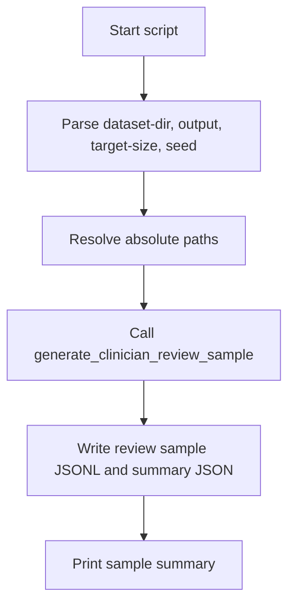

# build_phase2_clinician_review_sample.py FLOWCHART

```mermaid
flowchart TD
    A[Start script] --> B[Parse dataset-dir, output, target-size, seed]
    B --> C[Resolve absolute paths]
    C --> D[Call generate_clinician_review_sample]
    D --> E[Write review sample JSONL and summary JSON]
    E --> F[Print sample summary]
```
