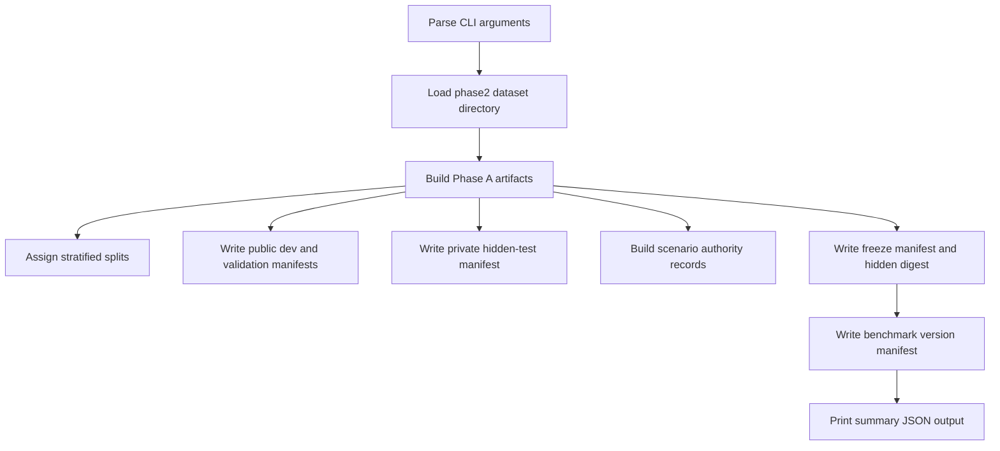

# build_phaseA_artifacts.py FLOWCHART

```mermaid
flowchart TD
    A[Parse CLI arguments] --> B[Load phase2 dataset directory]
    B --> C[Build Phase A artifacts]
    C --> D[Assign stratified splits]
    C --> E[Write public dev and validation manifests]
    C --> F[Write private hidden-test manifest]
    C --> G[Build scenario authority records]
    C --> H[Write freeze manifest and hidden digest]
    H --> I[Write benchmark version manifest]
    I --> J[Print summary JSON output]
```
