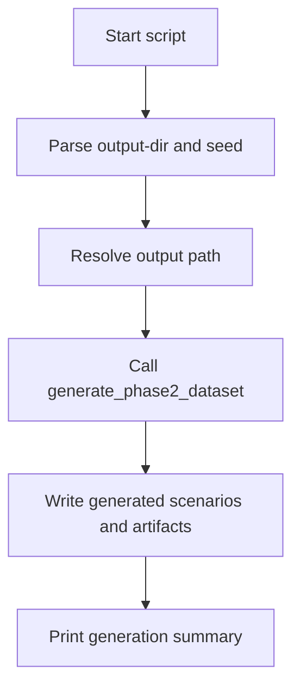

# generate_phase2_dataset.py FLOWCHART

```mermaid
flowchart TD
    A[Start script] --> B[Parse output-dir and seed]
    B --> C[Resolve output path]
    C --> D[Call generate_phase2_dataset]
    D --> E[Write generated scenarios and artifacts]
    E --> F[Print generation summary]
```
