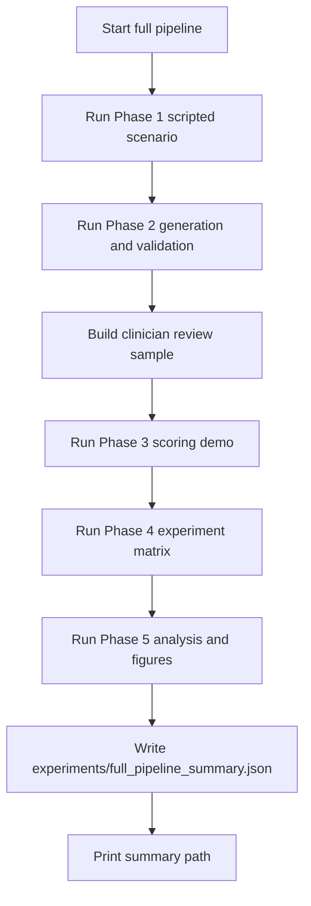

# run_full_pipeline.py FLOWCHART

```mermaid
flowchart TD
    A[Start full pipeline] --> B[Run Phase 1 scripted scenario]
    B --> C[Run Phase 2 generation and validation]
    C --> D[Build clinician review sample]
    D --> E[Run Phase 3 scoring demo]
    E --> F[Run Phase 4 experiment matrix]
    F --> G[Run Phase 5 analysis and figures]
    G --> H[Write experiments/full_pipeline_summary.json]
    H --> I[Print summary path]
```
