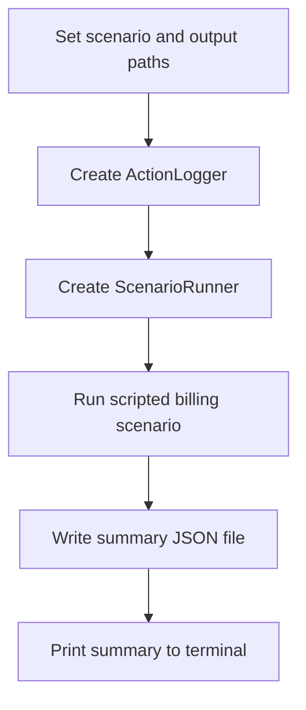

# run_phase1_demo.py FLOWCHART

```mermaid
flowchart TD
    A[Set scenario and output paths] --> B[Create ActionLogger]
    B --> C[Create ScenarioRunner]
    C --> D[Run scripted billing scenario]
    D --> E[Write summary JSON file]
    E --> F[Print summary to terminal]
```
