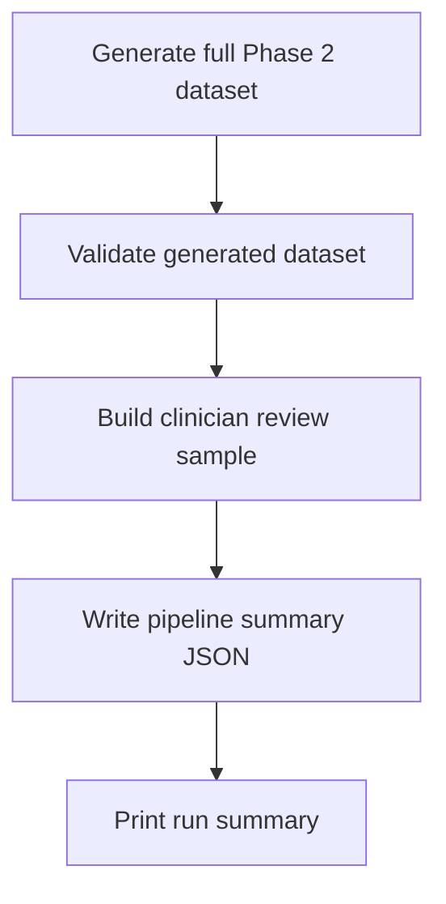

# run_phase2_pipeline.py FLOWCHART

```mermaid
flowchart TD
    A[Generate full Phase 2 dataset] --> B[Validate generated dataset]
    B --> C[Build clinician review sample]
    C --> D[Write pipeline summary JSON]
    D --> E[Print run summary]
```
