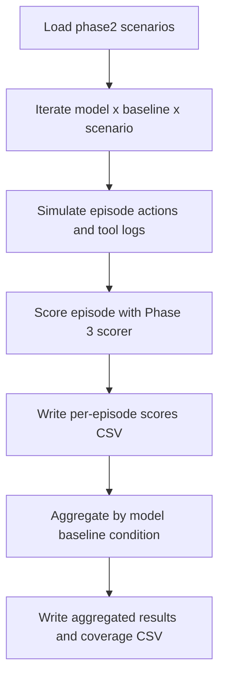

# run_phase4_experiments.py FLOWCHART

```mermaid
flowchart TD
    A[Load phase2 scenarios] --> B[Iterate model x baseline x scenario]
    B --> C[Simulate episode actions and tool logs]
    C --> D[Score episode with Phase 3 scorer]
    D --> E[Write per-episode scores CSV]
    E --> F[Aggregate by model baseline condition]
    F --> G[Write aggregated results and coverage CSV]
```
