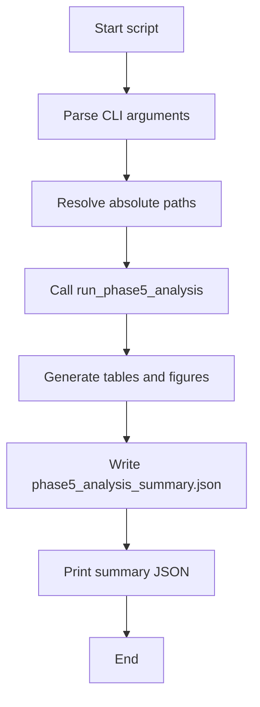

# run_phase5_analysis.py FLOWCHART

```mermaid
flowchart TD
    A[Start script] --> B[Parse CLI arguments]
    B --> C[Resolve absolute paths]
    C --> D[Call run_phase5_analysis]
    D --> E[Generate tables and figures]
    E --> F[Write phase5_analysis_summary.json]
    F --> G[Print summary JSON]
    G --> H[End]
```
