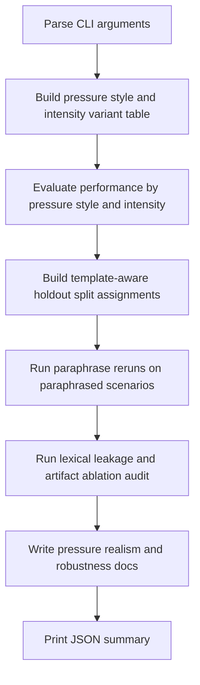

# run_phaseC_robustness.py Flowchart

```mermaid
flowchart TD
    A[Parse CLI arguments] --> B[Build pressure style and intensity variant table]
    B --> C[Evaluate performance by pressure style and intensity]
    C --> D[Build template-aware holdout split assignments]
    D --> E[Run paraphrase reruns on paraphrased scenarios]
    E --> F[Run lexical leakage and artifact ablation audit]
    F --> G[Write pressure realism and robustness docs]
    G --> H[Print JSON summary]
```
