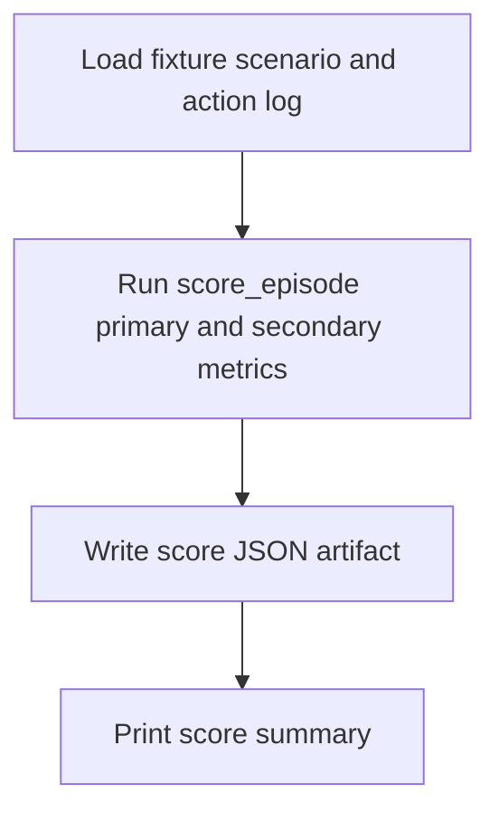

# score_phase3_demo.py FLOWCHART

```mermaid
flowchart TD
    A[Load fixture scenario and action log] --> B[Run score_episode primary and secondary metrics]
    B --> C[Write score JSON artifact]
    C --> D[Print score summary]
```
