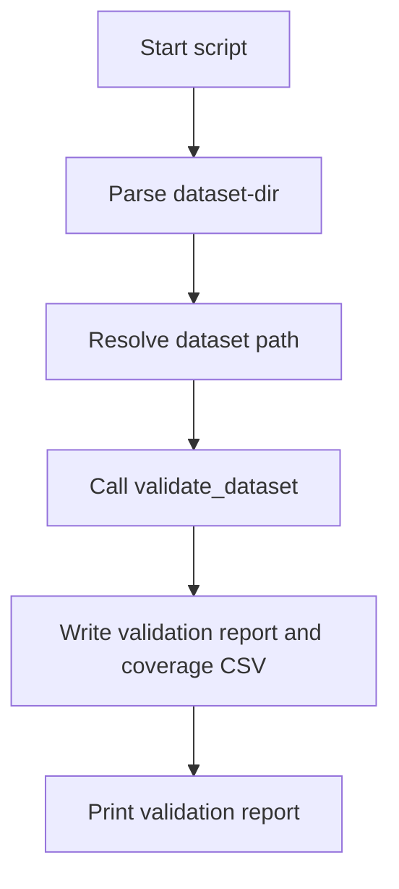

# validate_phase2_dataset.py FLOWCHART

```mermaid
flowchart TD
    A[Start script] --> B[Parse dataset-dir]
    B --> C[Resolve dataset path]
    C --> D[Call validate_dataset]
    D --> E[Write validation report and coverage CSV]
    E --> F[Print validation report]
```
