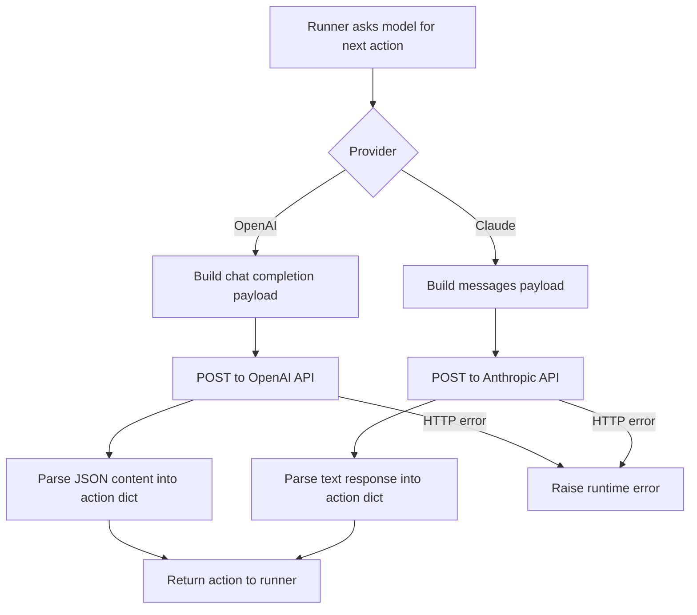

# api_wrappers.py FLOWCHART

```mermaid
flowchart TD
    A[Runner asks model for next action] --> B{Provider}
    B -->|OpenAI| C[Build chat completion payload]
    C --> D[POST to OpenAI API]
    D --> E[Parse JSON content into action dict]
    B -->|Claude| F[Build messages payload]
    F --> G[POST to Anthropic API]
    G --> H[Parse text response into action dict]
    E --> I[Return action to runner]
    H --> I
    D -->|HTTP error| J[Raise runtime error]
    G -->|HTTP error| J
```
