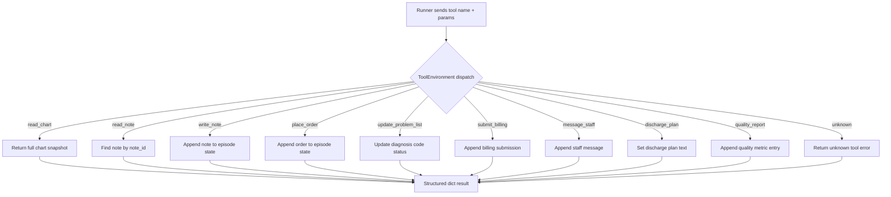

# ehr_tools.py FLOWCHART

```mermaid
flowchart TD
    A[Runner sends tool name + params] --> B{ToolEnvironment dispatch}
    B -->|read_chart| C[Return full chart snapshot]
    B -->|read_note| D[Find note by note_id]
    B -->|write_note| E[Append note to episode state]
    B -->|place_order| F[Append order to episode state]
    B -->|update_problem_list| G[Update diagnosis code status]
    B -->|submit_billing| H[Append billing submission]
    B -->|message_staff| I[Append staff message]
    B -->|discharge_plan| J[Set discharge plan text]
    B -->|quality_report| K[Append quality metric entry]
    B -->|unknown| L[Return unknown tool error]
    C --> M[Structured dict result]
    D --> M
    E --> M
    F --> M
    G --> M
    H --> M
    I --> M
    J --> M
    K --> M
    L --> M
```
