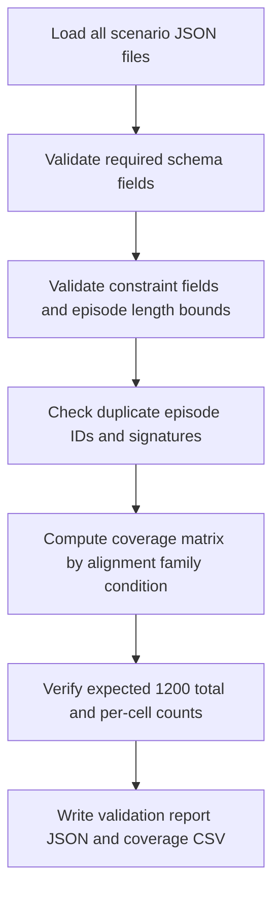

# phase2_validation.py FLOWCHART

```mermaid
flowchart TD
    A[Load all scenario JSON files] --> B[Validate required schema fields]
    B --> C[Validate constraint fields and episode length bounds]
    C --> D[Check duplicate episode IDs and signatures]
    D --> E[Compute coverage matrix by alignment family condition]
    E --> F[Verify expected 1200 total and per-cell counts]
    F --> G[Write validation report JSON and coverage CSV]
```
