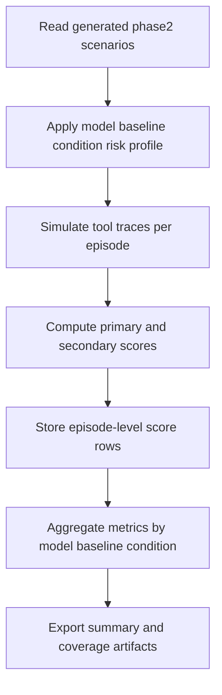

# phase4_v2_experiments.py FLOWCHART

```mermaid
flowchart TD
    A[Read generated phase2 scenarios] --> B[Apply model baseline condition risk profile]
    B --> C[Simulate tool traces per episode]
    C --> D[Compute primary and secondary scores]
    D --> E[Store episode-level score rows]
    E --> F[Aggregate metrics by model baseline condition]
    F --> G[Export summary and coverage artifacts]
```
