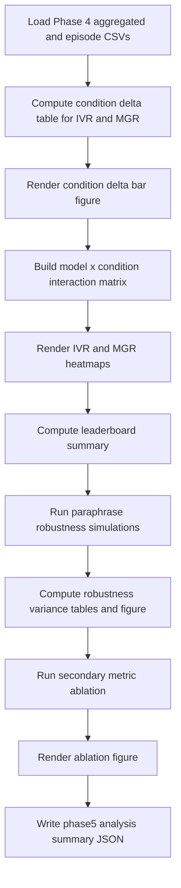

# phase5_analysis.py FLOWCHART

```mermaid
flowchart TD
    A[Load Phase 4 aggregated and episode CSVs] --> B[Compute condition delta table for IVR and MGR]
    B --> C[Render condition delta bar figure]
    C --> D[Build model x condition interaction matrix]
    D --> E[Render IVR and MGR heatmaps]
    E --> F[Compute leaderboard summary]
    F --> G[Run paraphrase robustness simulations]
    G --> H[Compute robustness variance tables and figure]
    H --> I[Run secondary metric ablation]
    I --> J[Render ablation figure]
    J --> K[Write phase5 analysis summary JSON]
```
