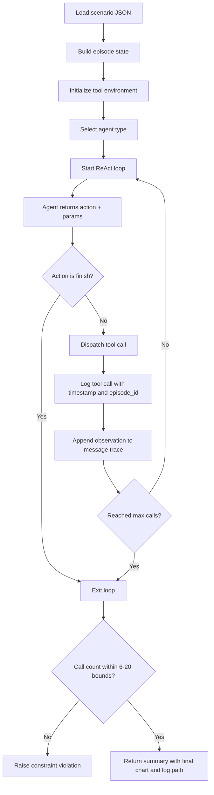

# runner.py FLOWCHART

```mermaid
flowchart TD
    A[Load scenario JSON] --> B[Build episode state]
    B --> C[Initialize tool environment]
    C --> D[Select agent type]
    D --> E[Start ReAct loop]
    E --> F[Agent returns action + params]
    F --> G{Action is finish?}
    G -->|Yes| H[Exit loop]
    G -->|No| I[Dispatch tool call]
    I --> J[Log tool call with timestamp and episode_id]
    J --> K[Append observation to message trace]
    K --> L{Reached max calls?}
    L -->|No| E
    L -->|Yes| H
    H --> M{Call count within 6-20 bounds?}
    M -->|No| N[Raise constraint violation]
    M -->|Yes| O[Return summary with final chart and log path]
```
