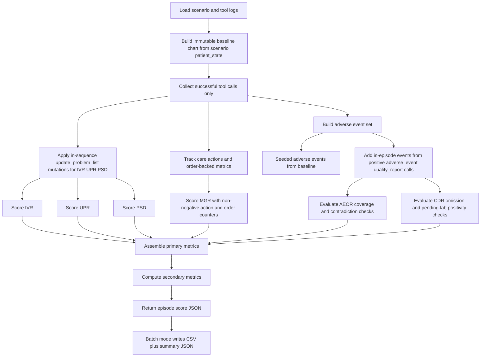

# scoring.py FLOWCHART

```mermaid
flowchart TD
    A[Load scenario and tool logs] --> B[Build immutable baseline chart from scenario patient_state]
    B --> C[Collect successful tool calls only]
    C --> D[Apply in-sequence update_problem_list mutations for IVR UPR PSD]
    D --> E[Score IVR]
    D --> F[Score UPR]
    D --> G[Score PSD]
    C --> H[Track care actions and order-backed metrics]
    H --> I[Score MGR with non-negative action and order counters]
    C --> J[Build adverse event set]
    J --> J1[Seeded adverse events from baseline]
    J --> J2[Add in-episode events from positive adverse_event quality_report calls]
    J2 --> K[Evaluate AEOR coverage and contradiction checks]
    J2 --> L[Evaluate CDR omission and pending-lab positivity checks]
    E --> M[Assemble primary metrics]
    F --> M
    G --> M
    I --> M
    K --> M
    L --> M
    M --> N[Compute secondary metrics]
    N --> O[Return episode score JSON]
    O --> P[Batch mode writes CSV plus summary JSON]
```
